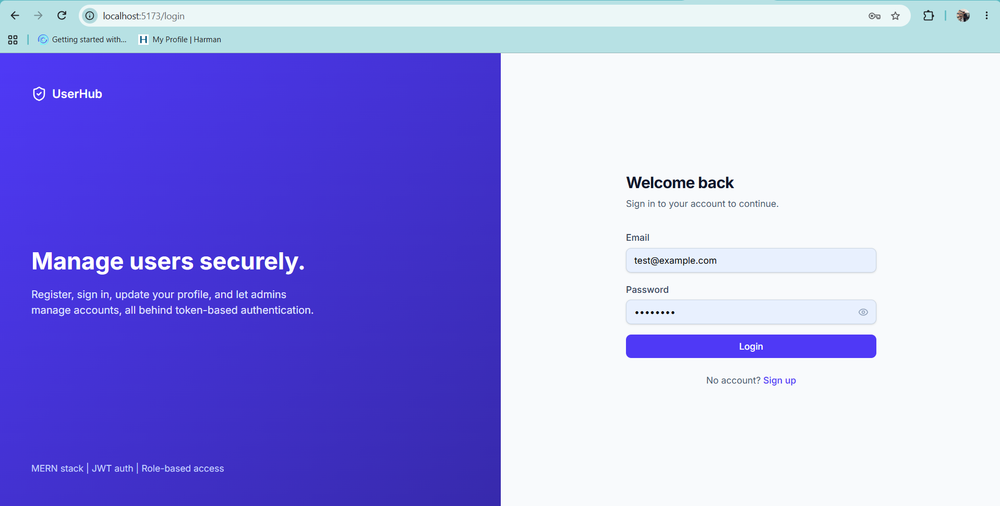
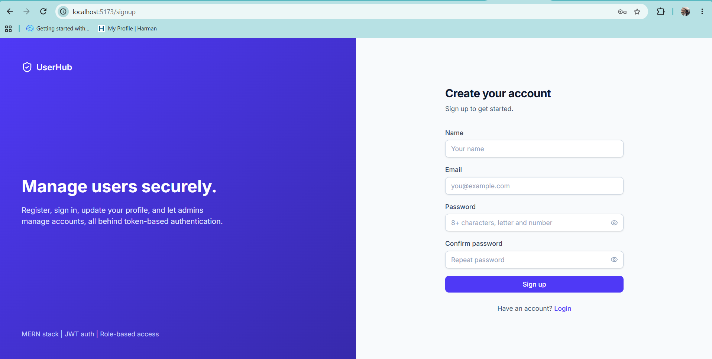
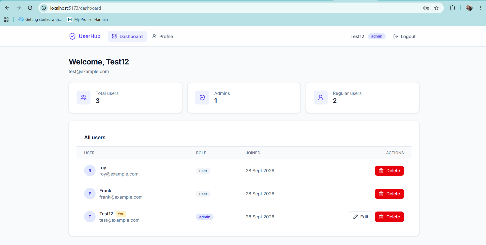
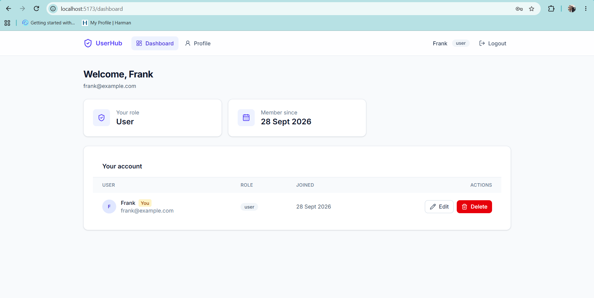
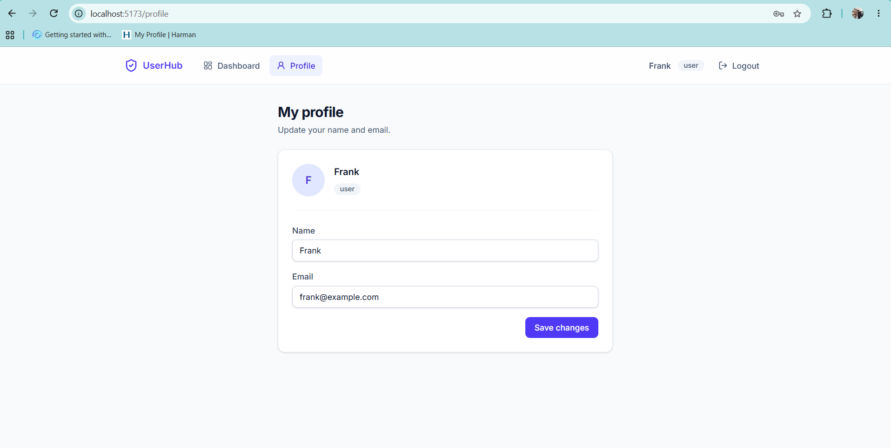

# UserHub: Secure User Management System

A full-stack **MERN** application for secure user registration, authentication and role-based administration. It pairs a hardened Express 5 REST API with a responsive React interface, and is built around production-minded practices: validated input, hashed credentials, rate limiting and least-privilege access control.


---

## Live Demo

> Fill these in after deployment, or delete this section if you are not hosting the project.

| | Link |
| --- | --- |
| [**Application**](https://mern-user-management-system-plum.vercel.app/login) |
| [**API health check**](https://mern-user-management-system-3w89.onrender.com/api/health) |

**Demo account (standard user):** `frank@example.com` / `Test1234`

The free-tier API may take about 30 seconds to wake up on the first request.

---

## Screenshots

### Login


### Signup


### Admin dashboard


### User dashboard


### Profile


---

## Features

### Authentication
- Signup and login with **JWT** access tokens (HS256, configurable expiry)
- Passwords hashed with **bcrypt** (cost factor 12), never stored or returned in plain text
- Session restored on page load by re-validating the token against the API
- Automatic logout and redirect when a token expires or is rejected
- Protected and public route guards that preserve the page a user was trying to reach

### User management (CRUD)
- **Create:** self-service registration
- **Read:** profile view for every user, and a full user directory for admins
- **Update:** profile editing that sends only the fields that changed
- **Delete:** admins can remove any user, and users can delete their own account, behind a confirmation modal

### Role-based access control
- Two roles, `user` and `admin`, enforced on the server and reflected in the UI
- Admins see and manage every account, while standard users see only their own
- Roles can never be set through signup or profile requests, since unknown fields are stripped by validation
- The user is loaded from the database on every authenticated request, so deleted accounts lose access immediately

### Security
- **Input validation** with zod v4 on every write endpoint, returning structured per-field errors
- **helmet** security headers and a **CORS** policy restricted to the configured client origin
- **Rate limiting:** a global limit on the API, plus a stricter limit on signup and login to slow brute-force attempts
- **Timing-safe login:** a dummy hash comparison runs for unknown emails, so response time does not reveal which accounts exist
- **Duplicate-safe signup:** handles the MongoDB duplicate-key race condition in addition to the pre-check
- **Request hardening:** 10 KB JSON body limit, JWT algorithm pinning, and an error handler that never leaks internals

### User experience
- Responsive **Tailwind CSS** interface with a split-screen auth layout
- Toast notifications, loading states on buttons, and accessible focus rings
- Client-side validation with clear inline errors, backed by server-side validation

---

## Tech Stack

### Frontend
| Technology | Purpose |
| --- | --- |
| React (Vite) | UI library and build tooling |
| React Router | Client-side routing and route guards |
| Context API | Auth and toast state management |
| Axios | HTTP client with request and response interceptors |
| Tailwind CSS v4 | Utility-first styling |
| lucide-react | Icon set |
| Inter (Fontsource) | Typography |

### Backend
| Technology | Purpose |
| --- | --- |
| Node.js | Runtime |
| Express 5 | REST API framework |
| MongoDB Atlas + Mongoose | Database and object modeling |
| JSON Web Tokens | Stateless authentication |
| bcryptjs | Password hashing |
| zod v4 | Schema validation |
| helmet, cors | Security headers and origin control |
| express-rate-limit | Abuse and brute-force protection |
| morgan | HTTP request logging (development) |

---

## API Reference

Base path: `/api`

| Method | Endpoint | Access | Description |
| --- | --- | --- | --- |
| `GET` | `/health` | Public | Service health check |
| `POST` | `/auth/signup` | Public | Register a user, returns `{ token, user }` |
| `POST` | `/auth/login` | Public | Authenticate, returns `{ token, user }` |
| `GET` | `/users/profile` | Authenticated | Get the current user |
| `PUT` | `/users/profile` | Authenticated | Update own name and/or email |
| `GET` | `/users` | Admin | List all users, newest first |
| `DELETE` | `/users/:id` | Admin or self | Delete a user |

Protected routes expect an `Authorization: Bearer <token>` header. Errors return JSON in the form `{ "message": "...", "errors": [{ "field", "message" }] }`.

---

## Project Structure

```
user-management-system/
├── client/                     # React front end
│   └── src/
│       ├── api/                # Axios instance and interceptors
│       ├── components/         # Layout, route guards, ui/ primitives
│       ├── context/            # Auth and toast providers and hooks
│       ├── lib/                # Utilities
│       └── pages/              # Login, Signup, Dashboard, Profile, NotFound
├── server/                     # Express API
│   └── src/
│       ├── config/             # Database connection
│       ├── controllers/        # Request handlers
│       ├── middleware/         # Auth, admin guard, validation
│       ├── models/             # Mongoose models
│       ├── routes/             # Route definitions
│       ├── utils/              # Token helpers
│       ├── validators/         # zod schemas
│       ├── app.js              # Express app setup
│       └── server.js           # Entry point
└── docs/screenshots/
```

---

## Getting Started

### Prerequisites
- **Node.js 22 or later**
- A **MongoDB Atlas** cluster (the free M0 tier is enough) or a local MongoDB instance
- **Git**

### 1. Clone the repository

```bash
git clone https://github.com/ABHISHEKTU/mern-user-management-system.git
cd mern-user-management-system
```

### 2. Set up the server

```bash
cd server
npm install
cp .env.example .env
```

Open `server/.env` and fill in the values:

| Variable | Description | Example |
| --- | --- | --- |
| `PORT` | API port | `5000` |
| `NODE_ENV` | Environment | `development` |
| `MONGO_URI` | MongoDB connection string, ending in `/user_management` | `mongodb+srv://<user>:<password>@<cluster>/user_management` |
| `JWT_SECRET` | Long random secret for signing tokens | see below |
| `JWT_EXPIRES_IN` | Token lifetime | `1d` |
| `CLIENT_URL` | Allowed front-end origin for CORS | `http://localhost:5173` |

Generate a strong secret:

```bash
node -e "console.log(require('crypto').randomBytes(48).toString('hex'))"
```

Start the API:

```bash
npm run dev
```

The API runs at `http://localhost:5000`. Verify it at `http://localhost:5000/api/health`.

> The dev script uses Node's built-in `--env-file` and `--watch` flags. Restart it manually after editing `.env`.

### 3. Set up the client

In a second terminal:

```bash
cd client
npm install
cp .env.example .env
```

Set the API URL in `client/.env`:

```
VITE_API_URL=http://localhost:5000/api
```

Start the app:

```bash
npm run dev
```

The app runs at `http://localhost:5173`.

### 4. Create an admin account

For security, signup always creates a standard user. To create an admin:

1. Register a normal account through the app.
2. In MongoDB Atlas, open the `users` collection of the `user_management` database.
3. Change that user's `role` field from `user` to `admin`.
4. Log out and back in.

### Useful scripts

| Location | Command | Description |
| --- | --- | --- |
| `server` | `npm run dev` | Start the API with auto-reload |
| `server` | `npm start` | Start the API without watch mode |
| `client` | `npm run dev` | Start the Vite dev server |
| `client` | `npm run build` | Create a production build |
| `client` | `npm run lint` | Run ESLint |

---

## Design Decisions

- **Database-backed auth checks.** The middleware loads the user on each request instead of trusting token claims, so role changes and deletions take effect immediately.
- **Validation as a security boundary.** zod schemas strip unknown fields, which makes mass-assignment attacks such as injecting `role` ineffective by construction.
- **Layered abuse protection.** A global limiter protects the API, and a tighter one protects the credential endpoints.
- **Small, predictable state.** Context API covers everything the app needs, with no extra state library to maintain.

---

## Known Limitations and Roadmap

Being upfront about the trade-offs:

- The JWT is stored in `localStorage`, which is readable by injected scripts. Moving to an httpOnly cookie is the planned hardening step.
- An admin can currently delete their own account, which could leave the system with no admin.
- Not yet implemented: automated tests, password change, email verification, pagination and search on the users table.

---

## Author

**Abhishek**
GitHub: [@ABHISHEKTU](https://github.com/ABHISHEKTU)

---

## License

Released under the [MIT License](LICENSE).
